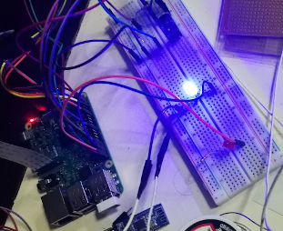

# Automated Home Security System
Developed an automated home security system that uses raspberry pi and other sensors to detect intrusion and execute remote commands.

## System Overview
Please checkout the slide [click here](System_Overview.pdf)

## Features
- Ultrasonic sensor is used to detect intrusion (door opening / closing)
- Pi Camera takes snap of intruder
- Email is used as medium of communication between user and system
- Remote commands can be sent via email to execute actions on the system at home
- Pi speaker / any attached speaker can trigger alarm / speak remote text using text to speech synthesis (tts)
- System can whitelist phone bluetooth HWID. If phone is detected to be within proximity, the system deactivates intrusion detection.
- Multiprocessing module is used extensively making it possible for the system to detect intrusion, check and execute remote commands at the same time 
- Resource locks are used, which allow resources to be shared between concurrent processes
  without conflicts
- Code is simple, clean and coded from scratch in Python.

## Remote commands 
Arm - Activate intrusion detection 
Disarm - Deactivate intrusion detection 
Snap - Take photo  
Quote - Speak a random quote using tts 

** This project is no longer publicly maintained **
