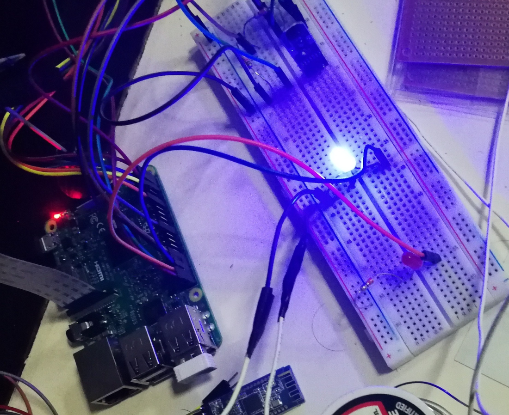

# Automated Home Security System
Developed an automated home security system that uses raspberry pi and other sensors to detect intrusion and execute remote commands.

## Features
- Ultrasonic sensor is used to detect intrusion (door opening / closing)
- Pi Camera takes snap of intruder
- Email is used as medium of communication between user and system
- Remote commands can be sent via email to execute actions on the system at home
- Pi speaker / any attached speaker can trigger alarm / speak remote text using text to speech synthesis (tts)
- System can whitelist phone bluetooth HWID. If phone is detected to be within proximity, the system deactivates intrusion detection.
- Multiprocessing module is used extensively making it possible for the system to detect intrusion, check and execute remote commands at the same time 
- Resource locks are used, which allow resources to be shared between concurrent processes
  without conflicts
- Code is simple, clean and coded from scratch in Python.

## Remote commands
- The following commands are to be specified in the header section of the bot email.
- User's email needs to be specified in the config file

### Arm - Activate intrusion detection. 
This uses the ultrasonic module to scan continuously for any signs of intrusion.
command: <bot@email.com> arm

### Disarm - Deactivate intrusion detection
Intrusion detection is disabled but the system still scans for remote commands
continuously.
command: <bot@email.com> disarm

### Snap - Take photo 
A photo is taken using pi camera and is sent back as report to user's email
command: <bot@email.com> snap

### Quote - Speak a random quote using tts
Quote is randomly generated and requires the package 'fortune' to be pre-installed.
command: <bot@email.com> quote

### Text - Speak specified text using tts 
command: <bot@email.com> "This is a test"

## TODO
- Detailed information regarding hardware & software setup will be provided soon

